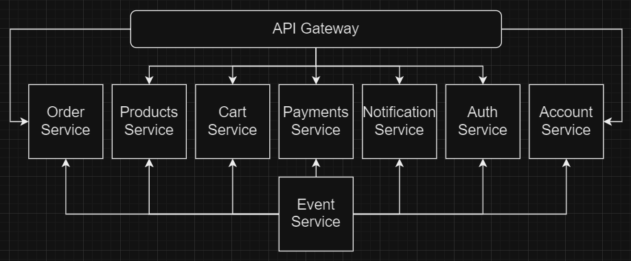

# Backend for e-commerce website using microservices architecture

- API Gateway:
  1. Rate limit checks
  2. Payload validation
  3. Service call
  4. Check user from blocked list
  5. Generate a request id, trigger corresponding request when task is done
  
  API Gateway exposes following endpoints in /v1 group:
    1. /orders
    GET: list all orders for logged in account
    POST: orders an item
    2. /products
    GET: list products related to given string
    POST: add a product
    3. /cart
    GET: get all items in logged-in user's cart
    4. /payments
    POST:
    5. /notification
    POST: sends a respective notification to email/phone
    6. /auth
    POST: validate headers and authentication data
    7. /account
        - /login
        POST: login and create session
        - /logout
        POST: logout and clear session
        - /register
        POST: create new account and return a session
        - /delete
        POST: delete an account

- Order Service:
    1. Create an order
    2. Confirm an order
    3. Edit an order
    4. Cancel an order

- Products Service:
    1. List all orders based on tag
    2. Add a product, only for sellers

- Cart Service:
    1. Get all items in logger-in user's cart

- Payments Service:

- Notification Service:
    1. Send email
    2. Send SMS
    3. Send push notification on browser

- Auth Service:
    1. Password based authentication
    2. JWT based authentication
    3. Session-Cookie

- Account Service:
    1. Registration as customer & seller
    2. Login, Logout for user
    3. Delete account
