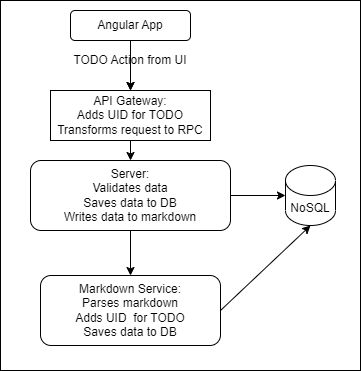

# Markdown Based Record Logging Application

## Requirements

- Markdown based record log
  - Parse markdown
  - Export data to NoSQL db
  - Update markdown & db with new data
  - Update db on markdown update
  - TODO: Edit/remove data from markdown
  - TODO: Allow tag based search and full text search
  - TODO: Allow exporting/importing HTML/JSON/CSV/YAML/TOML files
  - TODO: Structure extracted text in JSON & CSV

## Design

### High Level Design

### Low Level Design

- Parse markdown
- Each entry should have
- TODO: Build parser

## Use Cases

- Read log
  - Should allow entry of books currently being read, wishlist, books read
  - Configurable alarm, and whatsapp message to record page number of books currently being read, throw reminders for spaced repetitions of read books
  - Should remember day wise data entered
  - Should provide API to fetch all data

- Link recorder
  - TBD

- Todo list
  - TBD

- Course recorder
  - TBD
